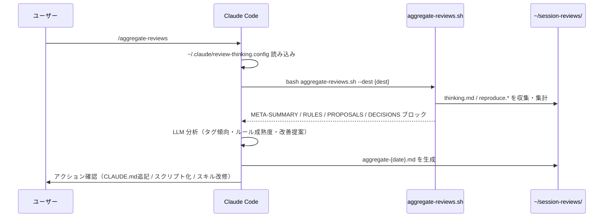

# aggregate-reviews

蓄積されたセッションレビュー（`review-thinking` が生成した `thinking.md` / `reproduce.*`）を横断分析し、ルール・スキル・スクリプトへの改善提案レポートを生成するスキル。

## 概要

`review-thinking` がセッションごとに生成したレビューを集積し、複数セッションにわたるパターンを検出して自己改善サイクルを回します。



## 分析セクション

| セクション | 内容 |
|---|---|
| **A. タグ・アウトカム傾向** | タグ頻度・success/partial/failed の内訳 |
| **B. ルール成熟度** | 複数セッションで繰り返すルール → CLAUDE.md 追記草案 |
| **C. 未反映改善提案** | 反映状況が「未反映」の提案を対象ファイル別に集約 |
| **D. 繰り返し判断パターン** | スクリプト化・ルール化の候補 |
| **E. スキル・スクリプト改善提案** | 既存改修 + 新規追加提案 |
| **F. トークン最適化提案** | SKILL.md 行数チェック・スクリプト移行候補 |

## 前提条件

`~/.claude/review-thinking.config` に以下が設定されていること:

```
dest: /path/to/session-reviews
agent-setting-path: /path/to/agent-setting
```

`setup.sh` 実行時にインタラクティブに生成されます。

## 使用例

```bash
# 集積レビューを分析してレポート生成
/aggregate-reviews
```

レポートは `{dest}/aggregate-{YYYY-MM-DD}.md` に出力されます。

## アクション確認フロー

レポート生成後、影響の小さい順にユーザーへ確認:

1. **CLAUDE.md への追記** — ルール恒久化（確信度「高」のみ）
2. **スクリプト化の実施** — SKILL.md の決定的ロジックを `scripts/` に移行
3. **既存スキル・スクリプトの改修** — 未反映提案を1件ずつ提示
4. **新規スキル・スクリプトの追加** — 繰り返しパターンから新規提案
5. **新リポジトリ提案** — 情報提示のみ（実際の作成はユーザー判断）

## 関連

- [review-thinking](review-thinking.md) — セッションレビューの生成元
- [スクリプト（hooks）](scripts.md) — `aggregate-reviews.sh` の詳細
