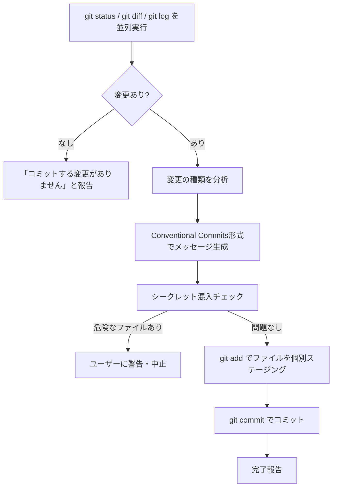

# commit スキル

> git変更を分析してConventional Commits形式でコミットメッセージを自動生成するスキル

## 概要

`commit` スキルは、現在のgit変更を分析し、適切なコミットメッセージを生成してコミットします。ステージング済み・未ステージの変更を一括処理し、シークレット混入チェックも行います。

## 使い方

Claude Code内で以下のように呼び出します:

```
/commit
```

または:

```
コミットして
変更をコミット
git commit
コミットメッセージを作って
```

## ワークフロー



## コミットメッセージの形式

[Conventional Commits](https://www.conventionalcommits.org/) 形式を使用します:

```
{type}({scope}): {概要}

{詳細（必要な場合のみ）}
```

### タイプ一覧

| タイプ | 使う場面 |
|--------|---------|
| `feat` | 新機能の追加 |
| `fix` | バグ修正 |
| `docs` | ドキュメントのみの変更 |
| `style` | コードの動作に影響しない整形・フォーマット |
| `refactor` | バグ修正でも機能追加でもないコード変更 |
| `test` | テストの追加・修正 |
| `chore` | ビルドプロセス・ツール・設定の変更 |
| `ci` | CI/CD設定の変更 |

### メッセージ例

```
feat(skill): add commit skill for automated git commits
fix(auth): handle null user session on login
docs: update README with setup instructions
improve(skill): add ordering constraint to review-thinking Step 6
```

## 安全機能

- `.env`・シークレット・認証情報を含むファイルを検出した場合、コミットせずユーザーに警告
- `git add -A` / `git add .` は使用せず、変更ファイルを個別指定してステージング
- pre-commit フックが失敗した場合は原因を修正してから新規コミットを作成（`--amend` / `--no-verify` は使用しない）

## 注意事項

- プッシュは明示的に指示された場合のみ実行します
- 概要は50文字以内が望ましい
- 変更が複数のタイプにまたがる場合は最も主要なものを選択します
