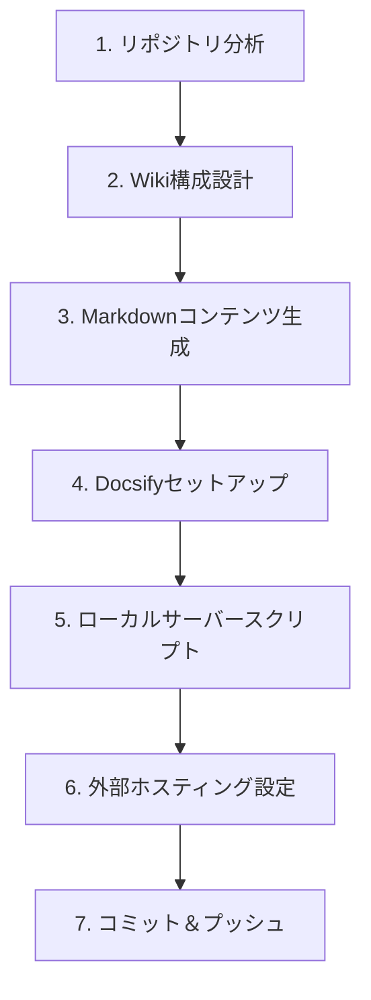

# create-git-wiki スキル

> gitリポジトリのコードベースをAIで分析し、Docsify形式のwikiを自動生成するスキル

## 概要

`create-git-wiki` は [deepwiki](https://deepwiki.com) にインスパイアされたスキルです。Claude Codeがコードベースを自律的に分析し、アーキテクチャ図・API仕様・開発ガイドを含む包括的なwikiを自動生成します。

**対応ホスティング:**
- ローカルプレビュー（python3 / npx serve）
- GitHub Pages（GitHub Actionsによる自動デプロイ）
- Netlify
- Vercel

## 使い方

Claude Code内で以下のように呼び出します:

```
create-git-wikiスキルを実行してください
```

または:

```
このリポジトリのwikiを生成して
```

## 生成される出力

```
wiki/
├── index.html              # Docsify エントリポイント（ビルド不要）
├── .nojekyll               # GitHub Pages の Jekyll 無効化
├── README.md               # ホームページ（プロジェクト概要・クイックスタート）
├── _sidebar.md             # サイドバーナビゲーション定義
├── overview.md             # アーキテクチャ概要・技術スタック
├── modules/                # モジュール・コンポーネント別詳細ドキュメント
│   └── {module-name}.md
├── api.md                  # API仕様（該当する場合）
├── contributing.md         # 開発環境・コントリビュートガイド
├── changelog.md            # git historyから生成した変更履歴
├── serve.sh                # ローカルプレビュー用スクリプト
├── netlify.toml            # Netlify デプロイ設定
└── vercel.json             # Vercel デプロイ設定

.github/
└── workflows/
    └── deploy-wiki.yml     # GitHub Pages 自動デプロイワークフロー
```

## ワークフロー詳細

スキルは以下の7つのフェーズで実行されます:



### フェーズ1: リポジトリ分析

以下のファイルを読み込んでプロジェクトを把握します:

- `README.md` / `README.rst` — プロジェクト概要
- `package.json` / `pyproject.toml` / `Cargo.toml` / `go.mod` — 技術スタック
- ソースコード（`src/`, `app/`, `lib/` 等）
- `git log --oneline -50` — 変更履歴

### フェーズ2: Wiki構成設計

分析結果に基づいて、必要なページを選択します。APIがないリポジトリでは `api.md` を省略するなど、プロジェクトの実態に合わせた構成を決定します。

### フェーズ3: Markdownコンテンツ生成

deepwikiスタイルの高品質なドキュメントを生成します:

- **なぜ**そう設計されているかを説明（コードの羅列ではない）
- mermaid.jsでアーキテクチャ図・データフロー図を生成
- コードスニペットはシンタックスハイライト付き

### フェーズ4: Docsifyセットアップ

ビルド不要のDocsifyを使用。`index.html` 一つでwikiサイトが動作します。

**搭載プラグイン:**
- 全文検索（docsify-search）
- コードコピーボタン（docsify-copy-code）
- Mermaid図レンダリング（docsify-mermaid）

### フェーズ5〜6: デプロイ設定

GitHub Pages / Netlify / Vercelの3つのホスティングオプションに対応した設定ファイルを生成します。

## ローカルプレビュー

```bash
bash wiki/serve.sh
# → http://localhost:3000 をブラウザで開く
```

## GitHub Pages へのデプロイ

1. wikiファイルをコミット＆プッシュ（スキルが自動実行）
2. リポジトリの Settings → Pages → Source → `gh-pages` ブランチを選択
3. URL: `https://{username}.github.io/{repo-name}/`

## 技術的な詳細

### Docsifyを選んだ理由

| 選択肢 | ビルド必要 | 設定複雑さ | mermaid対応 |
|--------|-----------|-----------|------------|
| Docsify | 不要 | 低 | プラグインで対応 |
| VitePress | 必要 | 中 | 標準対応 |
| Docusaurus | 必要 | 高 | プラグインで対応 |
| GitBook | 不要 | 低 | 対応 |

Docsifyは**ビルドステップが不要**で、静的ファイルをそのままGitHub Pagesに置くだけでwikiが動作します。CI/CDの設定を最小化できるため採用しています。

### mermaid図の仕組み

```html
<!-- Docsifyページ内でmermaidブロックを書くと自動レンダリング -->

```

`docsify-mermaid` プラグインがCDN経由でmermaid.jsを読み込み、ブラウザ側でSVGに変換します。インターネット接続が必要です。
