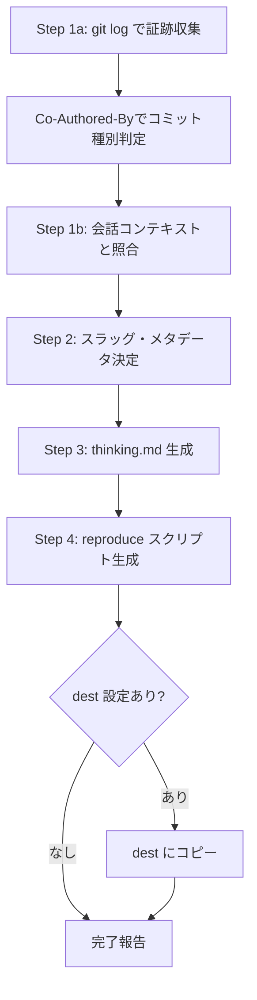
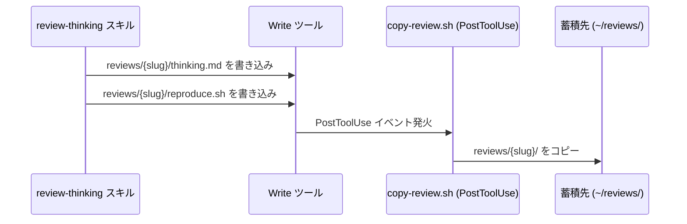

# review-thinking スキル

> Claude Codeセッションの思考・判断・実行を振り返り、再現可能な形に記録するスキル

## 概要

`review-thinking` は、セッション終了時・区切り時に呼び出すことで、そのセッションで何を考え、なぜその判断をしたかを構造化ドキュメントとして残します。将来の `aggregate-reviews` スキルによる横断分析の基盤にもなります。

**生成される2ファイル:**

| 成果物 | 説明 |
|--------|------|
| `thinking.md` | 思考プロセス・判断根拠・学習内容のドキュメント |
| `reproduce.{ext}` | セッションで用いた言語・環境に応じた再現スクリプト（Bash/Python/PS1等） |

## 使い方

セッション終了時または作業の区切り時に呼び出します:

```
/review-thinking
```

レビューのコピー先を指定する場合:

```
/review-thinking --dest ~/reviews
```

## 出力先

```
{プロジェクトルート}/reviews/
└── {YYYY-MM-DD}-{セッション概要スラッグ}/
    ├── thinking.md
    └── reproduce.{ext}
```

`--dest` オプションまたはプロジェクト内 `.claude/review-thinking.config` の設定がある場合は、生成後に `{dest}/{slug}/` にも同内容をコピーします。

## ワークフロー



## thinking.md の構造

```markdown
---
date: YYYY-MM-DD
slug: {slug}
title: {タイトル}
goal: {ゴール一行サマリー（英語推奨）}
tags: [git, file-edit, skill-creation, bash]
outcome: success | partial | failed
---

# {タイトル}

## セッションの目標・背景

## 実行したアクションの一覧（意思決定ログ）

| # | アクション | 判断理由 | 自信度 | 推測に頼った箇所 |
|---|-----------|---------|--------|----------------|
| 1 | ... | ... | 高/中/低 | ... |

## 推測から実測への修正

## 発生したエラーと対処

## 学習・知見

## 改善提案
```

## フックとの連携

`copy-review.sh` PostToolUse フックが設定されている場合、`reproduce.*` ファイルが書き込まれた瞬間に自動的にグローバル蓄積先にコピーされます。



## 設定ファイル

`~/.claude/review-thinking.config`（グローバル）または `.claude/review-thinking.config`（プロジェクト）に保存場所を指定できます:

```
# review-thinking グローバル設定
dest: ~/reviews
```

プロジェクト内設定がある場合はそちらが優先されます。

## 設計思想

### なぜ「再現スクリプト」を生成するか

AIセッションの結果は往々にして「どうやって到達したか」が失われます。`reproduce.*` スクリプトは、同じ状態を別環境・別タイミングで再現するための手順書です。

### 構造化メタデータの意義

YAML フロントマターの `tags`・`outcome`・`goal` は、将来の `aggregate-reviews` スキルが複数セッションを横断分析する際のインデックスになります。
