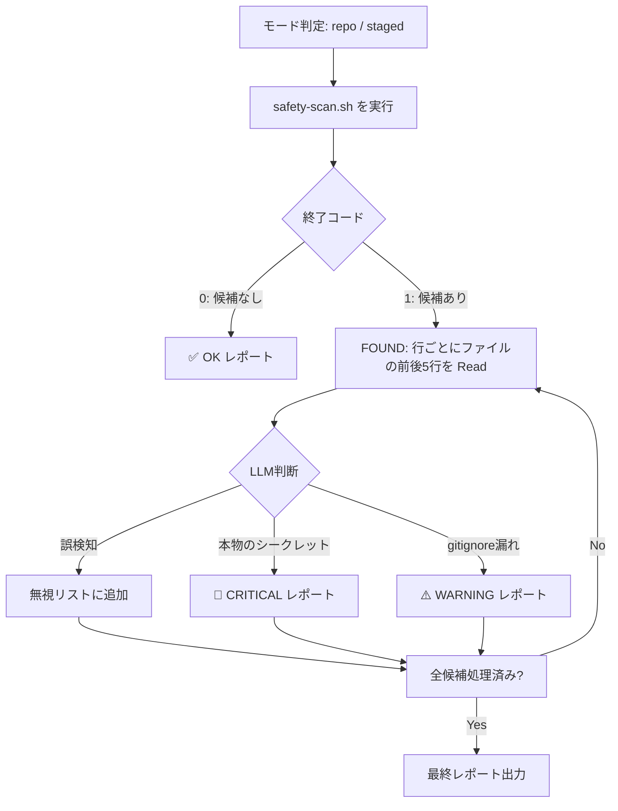

# safety-scan スキル

> シークレット・APIキー・.gitignore漏れをスクリプト＋LLM文脈分析で検出するスキル

## 概要

`safety-scan` は、リポジトリまたはステージ済みファイルを対象に、機密情報の混入を2段階でチェックします。

**2段階チェックの流れ:**

1. **第1パス（スクリプト）:** `scripts/safety-scan.sh` が正規表現でシークレット候補を高速スキャン
2. **第2パス（LLM文脈判断）:** 候補が見つかった場合、Claude が前後5行を読んで誤検知を除去

## 使い方

```
/safety-scan         # リポジトリ全体をスキャン
/safety-scan staged  # ステージ済みファイルのみ（コミット直前推奨）
```

または:

```
コミットしていいか確認して
シークレットが混入していないか確認
安全チェックして
```

## ワークフロー



## 検出対象

### シークレット候補（FOUND）

正規表現パターンで検出:
- `sk-`、`ghp_`、`AKIA`、`ya29.` などのサービス固有プレフィックス
- `API_KEY=`、`SECRET=`、`TOKEN=` などのキーワード + 値
- PEM形式のキーブロック（`-----BEGIN ... KEY-----`）
- Base64エンコードされた長い文字列

### gitignore漏れ（GITIGNORE_RISK）

追跡すべきでないファイルが git 管理下にある場合:
- `.env`、`.env.local`
- `*.pem`、`*.key`
- `credentials.json`、`secrets.json`

## 誤検知の判断基準

LLMが以下の場合は誤検知として無視します:
- プレースホルダー: `your_key_here`、`xxx`、`<YOUR_TOKEN>`、`dummy`
- 環境変数からの取得: `os.environ.get(...)`, `process.env.XXX`
- コメント・ドキュメント内の説明文
- テストコードのモック値（`test/`、`spec/`、`__tests__/` 以下）

## レポート形式

### 問題なし

```
✅ 問題は検出されませんでした。
スキャン対象: repo モード
```

### CRITICAL（本物のシークレット）

```
🚨 CRITICAL: シークレットが検出されました

- ファイル: .env（12行目）
  内容: API_KEY=sk-live-abcdef123456...
  対処: このファイルを .gitignore に追加し、git rm --cached で追跡を解除してください。
        シークレットは直ちにローテーション（無効化・再発行）してください。
```

### WARNING（.gitignore漏れ）

```
⚠️ WARNING: 追跡すべきでないファイルが git 管理下にあります

- .env（機密情報を含む可能性があります）
  対処: .gitignore に追加し、git rm --cached .env で追跡解除を推奨します。
```

## セットアップ

`setup.sh` / `setup.ps1` を実行すると `scripts/safety-scan.sh` が `~/.claude/scripts/` にインストールされます。

手動インストールの場合:

```bash
mkdir -p ~/.claude/scripts
cp scripts/safety-scan.sh ~/.claude/scripts/
chmod +x ~/.claude/scripts/safety-scan.sh
```

## commit スキルとの連携

コミット前の安全確認として `safety-scan staged` を使うのが推奨ワークフローです:

```
/safety-scan staged   # ステージ済みをスキャン → 問題なし → /commit
```
