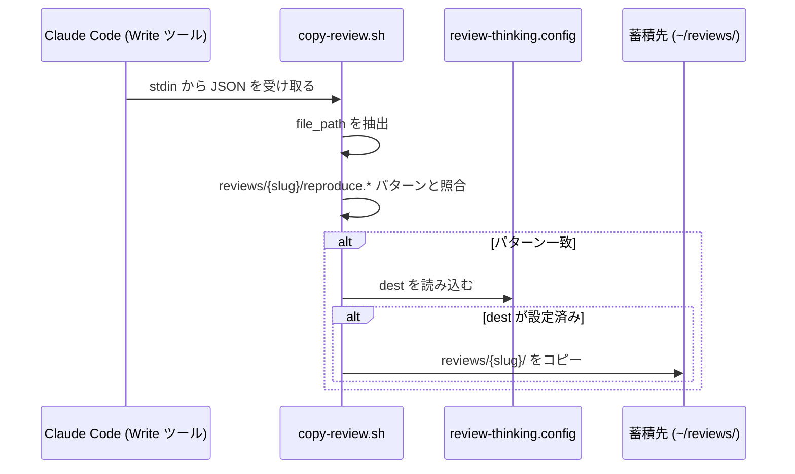

# スクリプト・フック

> `scripts/` ディレクトリに収録されているシェルスクリプトの説明

## 概要

`scripts/` には2つのスクリプトが含まれています。どちらも `setup.sh` / `setup.ps1` によって `~/.claude/scripts/` にインストールされます。

| スクリプト | 役割 |
|-----------|------|
| `safety-scan.sh` | シークレット・APIキーの正規表現スキャン（safety-scan スキルの第1パス） |
| `copy-review.sh` | PostToolUse フック: reviews/ へのファイル書き込みを検出して蓄積先にコピー |

---

## safety-scan.sh

**インストール先:** `~/.claude/scripts/safety-scan.sh`

**呼び出し方:**

```bash
bash ~/.claude/scripts/safety-scan.sh repo     # リポジトリ全体
bash ~/.claude/scripts/safety-scan.sh staged   # ステージ済みファイルのみ
```

**出力形式:**

```
FOUND:path/to/file:12:API_KEY=sk-live-abcdef
GITIGNORE_RISK:.env
```

**終了コード:**
- `0` — シークレット候補なし
- `1` — 候補あり

このスクリプトは `safety-scan` スキルの **第1パス** として使われます。Claude が第2パスとして候補をLLMで文脈判断し、誤検知を除去します。

---

## copy-review.sh

**インストール先:** `~/.claude/scripts/copy-review.sh`

**フック設定（`~/.claude/settings.json` に自動登録）:**

```json
{
  "hooks": {
    "PostToolUse": [
      {
        "matcher": "Write",
        "hooks": [
          {
            "type": "command",
            "command": "bash ~/.claude/scripts/copy-review.sh"
          }
        ]
      }
    ]
  }
}
```

### 動作の仕組み

Claude Code が `Write` ツールでファイルを書き込むたびに `copy-review.sh` が呼び出されます。スクリプトは書き込まれたパスを確認し、`reviews/{slug}/reproduce.*` パターンに一致する場合のみコピー処理を行います。



### 設定ファイルの優先順位

コピー先は以下の設定ファイルから読み込まれます（上が優先）:

1. `{project_root}/.claude/review-thinking.config`
2. `~/.claude/review-thinking.config`

設定例:

```
# review-thinking グローバル設定
dest: ~/reviews
```

`dest` が未設定の場合、コピー処理はスキップされます（エラーにはなりません）。

### Windows対応

スクリプトは Python 3 を使って JSON をパースし、`\\` → `/` のパス正規化を行います。WSL環境でも正しく動作します。

```bash
# Windows バックスラッシュをスラッシュに正規化
path = d.get('tool_input', {}).get('file_path', '')
print(path.replace('\\\\', '/'))
```

## セットアップ方法

### 自動（推奨）

```bash
bash setup.sh    # Linux / macOS / WSL
pwsh setup.ps1   # Windows PowerShell
```

### 手動

```bash
# スクリプトをコピー
mkdir -p ~/.claude/scripts
cp scripts/safety-scan.sh ~/.claude/scripts/
cp scripts/copy-review.sh ~/.claude/scripts/
chmod +x ~/.claude/scripts/safety-scan.sh
chmod +x ~/.claude/scripts/copy-review.sh

# copy-review フックを settings.json に登録（python3 が必要）
python3 - ~/.claude/settings.json << 'EOF'
import sys, json, os

settings_path = sys.argv[1]
hook_command = "bash ~/.claude/scripts/copy-review.sh"

if os.path.exists(settings_path):
    with open(settings_path, 'r') as f:
        settings = json.load(f)
else:
    settings = {}

hooks = settings.setdefault("hooks", {})
post_tool_use = hooks.setdefault("PostToolUse", [])
post_tool_use.append({
    "matcher": "Write",
    "hooks": [{"type": "command", "command": hook_command}]
})

with open(settings_path, 'w') as f:
    json.dump(settings, f, indent=2, ensure_ascii=False)
    f.write('\n')
EOF
```
