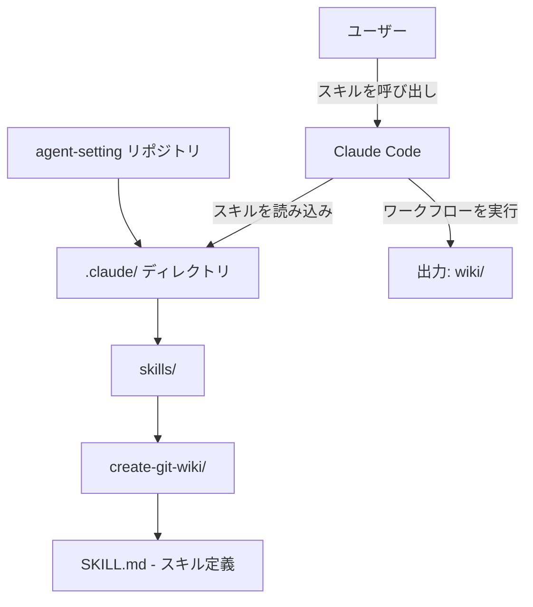
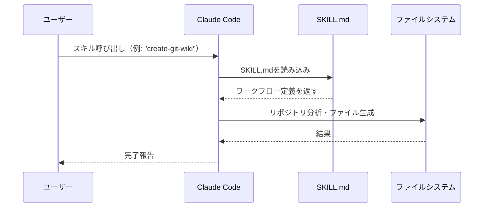

# アーキテクチャ概要

## システム構成

このリポジトリは、Claude Codeのカスタムスキルシステムを活用した設定管理リポジトリです。



## Claude Codeスキルの仕組み

Claude Codeのカスタムスキルは、`.claude/skills/{skill-name}/SKILL.md` に配置されたMarkdownファイルで定義されます。



## ディレクトリ構成

```
agent-setting/
├── .claude/
│   ├── CLAUDE.md           # プロジェクト共通のClaudeへの指示
│   └── skills/
│       └── create-git-wiki/
│           └── SKILL.md    # スキル定義（名前・説明・ワークフロー）
├── .gitignore              # Claude認証情報・キャッシュを除外
├── LICENSE
└── README.md
```

## スキル定義のフォーマット

各スキルは以下のフロントマターと本文で構成されます:

```markdown
---
name: skill-name
description: スキルの説明（Claude Codeがトリガー条件を判断するために使用）
---

# skill-name

## ワークフロー
... ステップバイステップの手順 ...
```

**`description`フィールドの重要性:** Claude Codeはこの説明文を元に、ユーザーの発言がスキルに該当するかを判断します。具体的かつ明確な説明が自動トリガーの精度を高めます。

## 技術スタック

| 要素 | 内容 | 理由 |
|------|------|------|
| スキル定義形式 | Markdown (SKILL.md) | 人間が読みやすく、バージョン管理しやすい |
| 設定管理 | Git | 変更履歴の追跡・チーム共有 |
| ホスティング | GitHub | スキルの共有・コラボレーション |
| Wiki形式 | Docsify | ビルド不要・静的ファイルのみで動作 |

## 設計思想

### スキルの自己完結性
各スキルはSKILL.md一つで完結するよう設計されています。外部依存なしに、Claude Codeが読むだけで実行できます。

### gitignoreによる情報管理
`.claude/auth.json` などの認証情報や `settings.json`（マシン依存のMCPパスを含む）はgitignoreで除外し、スキル定義のみを共有します。

### 段階的なワークフロー
スキルは「分析 → 設計 → 生成 → 検証 → デプロイ」という段階的なステップで構成され、各ステップが前のステップの結果を活用します。
