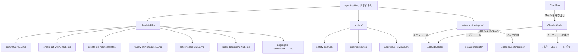
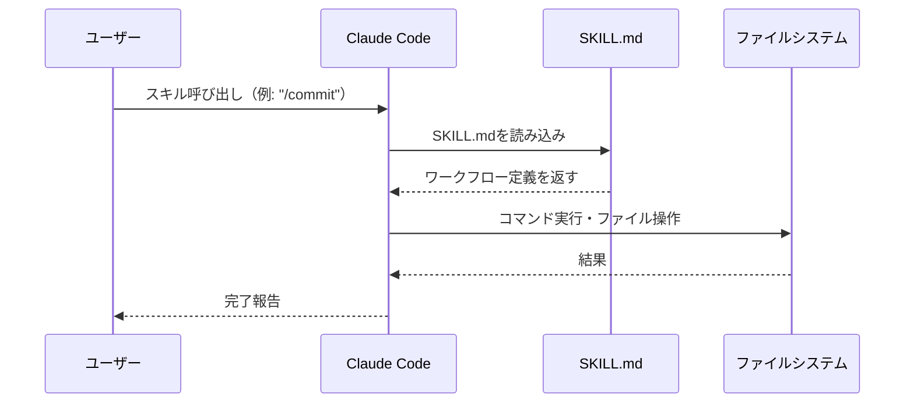
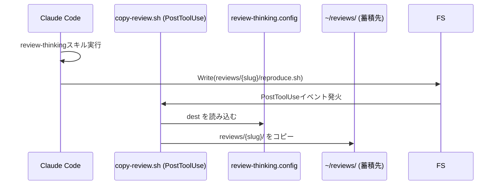

# アーキテクチャ概要

## システム構成

このリポジトリは、Claude Codeのカスタムスキルシステムを活用した設定管理リポジトリです。スキルをバージョン管理し、`setup.sh` で任意のマシンにインストールできます。



## Claude Codeスキルの仕組み

Claude Codeのカスタムスキルは、`claude/skills/{skill-name}/SKILL.md` に配置されたMarkdownファイルで定義されます。セットアップ後は `~/.claude/skills/` にコピーされ、全プロジェクトで利用可能になります。



## ディレクトリ構成

```
agent-setting/
├── claude/
│   └── skills/
│       ├── commit/
│       │   └── SKILL.md              # gitコミット自動化
│       ├── create-git-wiki/
│       │   ├── SKILL.md              # Wiki自動生成
│       │   └── templates/            # 静的テンプレートファイル群
│       │       ├── index.html        # Docsify エントリポイント
│       │       ├── serve.sh          # ローカルサーバースクリプト
│       │       ├── deploy-wiki.yml   # GitHub Actions ワークフロー
│       │       ├── netlify.toml      # Netlify 設定
│       │       └── vercel.json       # Vercel 設定
│       ├── review-thinking/
│       │   └── SKILL.md              # セッションレビュー記録
│       ├── safety-scan/
│       │   └── SKILL.md              # シークレットスキャン
│       ├── tackle-backlog/
│       │   └── SKILL.md              # バックログタスク管理
│       └── aggregate-reviews/
│           └── SKILL.md              # レビュー横断分析
├── scripts/
│   ├── copy-review.sh               # PostToolUseフック: レビューを自動コピー
│   ├── safety-scan.sh               # シークレットスキャン本体
│   └── aggregate-reviews.sh         # レビュー集計スクリプト
├── setup.sh                         # Linux/macOS/WSL セットアップ
├── setup.ps1                        # Windows PowerShell セットアップ
├── wiki/                            # このwikiサイト（Docsify）
├── .github/workflows/
│   └── deploy-wiki.yml              # GitHub Pages 自動デプロイ
├── .gitignore                       # Claude認証情報・キャッシュを除外
├── LICENSE
└── README.md
```

## スキル一覧と役割

| スキル | トリガー例 | 主な出力 |
|--------|-----------|---------|
| `commit` | `/commit`, 「コミットして」 | git commit |
| `create-git-wiki` | 「wikiを生成して」 | `wiki/` ディレクトリ |
| `review-thinking` | `/review-thinking` | `reviews/{slug}/thinking.md` + `reproduce.*` |
| `safety-scan` | `/safety-scan`, 「シークレット確認」 | スキャンレポート |
| `tackle-backlog` | `/tackle-backlog`, 「バックログを進めて」 | 実装 + BACKLOG.md 更新 |
| `aggregate-reviews` | `/aggregate-reviews` | `{dest}/aggregate-{date}.md` |

## スクリプト・フックの仕組み

`scripts/copy-review.sh` は Claude Code の **PostToolUse フック** として動作します。`Write` ツールが `reviews/*/reproduce.*` を書いた瞬間に自動実行され、グローバルなレビュー蓄積先にコピーします。



## スキル定義のフォーマット

各スキルは以下のフロントマターと本文で構成されます:

```markdown
---
name: skill-name
description: スキルの説明（Claude Codeがトリガー条件を判断するために使用）
---

# skill-name

## ワークフロー
... ステップバイステップの手順 ...
```

**`description`フィールドの重要性:** Claude Codeはこの説明文を元に、ユーザーの発言がスキルに該当するかを判断します。具体的なトリガー条件・使用例を書くことで自動トリガーの精度が高まります。

## 技術スタック

| 要素 | 内容 | 理由 |
|------|------|------|
| スキル定義形式 | Markdown (SKILL.md) | 人間が読みやすく、バージョン管理しやすい |
| 設定管理 | Git | 変更履歴の追跡・チーム共有 |
| ホスティング | GitHub | スキルの共有・コラボレーション |
| Wiki形式 | Docsify | ビルド不要・静的ファイルのみで動作 |
| フック | PostToolUse (bash) | Claude Code の拡張ポイント |

## 設計思想

### スキルの自己完結性
各スキルはSKILL.md一つで完結するよう設計されています。外部依存なしに、Claude Codeが読むだけで実行できます。

### gitignoreによる情報管理
`.claude/auth.json` などの認証情報や `settings.json`（マシン依存のMCPパスを含む）はgitignoreで除外し、スキル定義のみを共有します。`settings.local.json` もgitignore対象です。

### セットアップスクリプトによる冪等インストール
`setup.sh` / `setup.ps1` は既存ファイルの上書き確認・python3によるJSONマージなど、安全な冪等インストールを実現しています。

### 段階的なワークフロー
スキルは「分析 → 設計 → 生成 → 検証 → デプロイ」という段階的なステップで構成され、各ステップが前のステップの結果を活用します。TodoWrite ツールで進捗を管理します。
